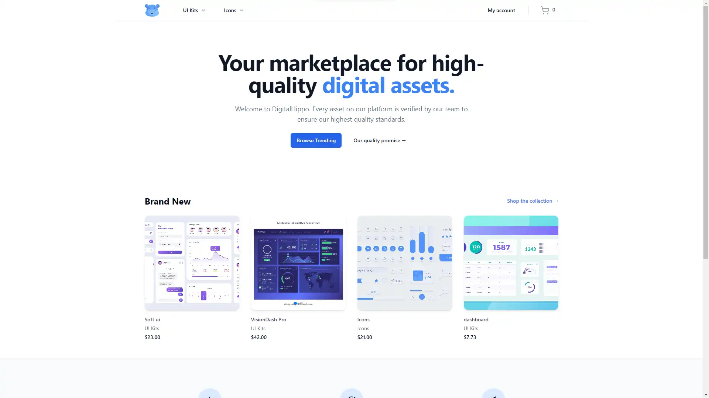

<h1> Digital Marketplace </h1>

Your marketplace for digital assets.



### 🌐 Website : https://digital-marketplace-ghencuyfzq-nw.a.run.app/  ###

## Features 💡

- Users can log in with credentials and ensure the security of their data.
- Secure payment using services like Stripe.
- List products for sale through a dynamic admin panel where they can create, read, update, and delete their products.
- Enjoy a responsive design for various device screen sizes.
- Admins can review products to ensure their integrity before the release.
  
## Built with ⚒️

- [NextJS](https://nextjs.org/) - The React Framework for the Web.
- [React](https://react.dev/) - A JavaScript library that allows you to create user interfaces.
- [TypeScript](https://www.typescriptlang.org/) -  A strongly typed programming language that builds on JavaScript.
- [Tailwind-css](https://tailwindcss.com/) - A utility-first CSS framework.
- [ExpressJS](https://expressjs.com/) - Fast, unopinionated, minimalist web framework for Node.js
- [Payload-CMS](https://payloadcms.com/) - A headless CMS and application framework.
- [TRPC](https://trpc.io/) - Allows you to easily build & consume fully typesafe APIs.
- [MongoDB-Atlas](https://www.mongodb.com/atlas/database) - A cloud database designed to accelerate and simplify how you build with data
- [shadcn](https://ui.shadcn.com/) -  Beautifully designed components that you can copy and paste into your apps. 


## Installation

- Clone the repository

```sh
git clone https://github.com/arr199/digital-marketplace
```

- Install dependencies

```sh
npm install
```

- Run server

```sh
 npm run dev
```
